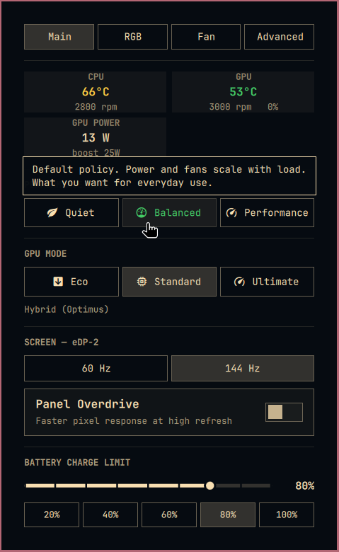

# Local ASUS customizations

This branch preserves the installed customization from September 30, 2026. The original five-file change is commit `fdc505c`, based on upstream `59b44a3`. The branch now also merges upstream `fe35c24`, preserving queued GPU values and the pending-restart indicator alongside Cardwire live switching. It remains a development branch until restart restoration is validated.

## Performance profiles

Profile selection saves the choice for the current AC or battery power source through `asusctl profile set --ac` or `--battery`. Bar-icon scrolling uses the same path. The independent version rebased on current upstream is submitted as [upstream PR #8](https://github.com/moneytosms/omarchy-asus/pull/8).

Hardware validation confirmed that changing AC leaves the saved battery profile unchanged, and changing battery leaves AC unchanged. The original saved profiles and active profile were restored after testing. Physical charger transitions were not exercised in this session.

## Cardwire GPU switching and restart confirmation

Eco and Standard use Cardwire Integrated and Hybrid modes for live switching. The panel reads the live daemon state, reports failures, and requires restart confirmation for transitions to or from Ultimate. Firmware writes are serialized, and a failed write stops the restart.

Before submitting this GPU feature upstream:

- Include a plugin-owned consumer for the `~/.local/state/omarchy-asus/pending-gpu-mode` marker. The current code writes it when leaving Ultimate, but the plugin ships no post-boot reader, and the audit found no installed reader.
- Preserve a usable firmware path when Cardwire is unavailable. The current customization disables Eco/Standard controls in that case.
- Verify the confirmed restart and post-boot GPU restoration on hardware. Those transitions were not exercised in this session.

The full custom model test suite passes, and the installed panel was opened and inspected for the screenshot. These checks do not establish the pending restart behavior as ready to ship.

The upstream merge uses raw numeric MUX values consistently. Regression checks cover live Eco, unchanged queues, pending Ultimate, leaving Ultimate, and firmware-disabled GPUs. The separate profile PR remains unchanged.
